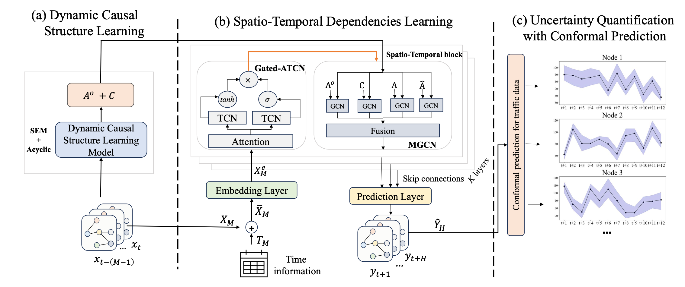

[](https://pubsonline.informs.org/journal/ijoc)

# Causally-Aware Spatio-Temporal Multi-Graph Convolution Network for Accurate and Reliable Traffic Prediction


This archive is distributed in association with the [INFORMS Journal on
Computing](https://pubsonline.informs.org/journal/ijoc) under the [MIT License](LICENSE).

The software and data in this repository are a snapshot of the software and data
that were used in the research reported on in the paper 
[Causally-Aware Spatio-Temporal Multi-Graph Convolution Network for Accurate and Reliable Traffic Prediction](https://doi.org/10.1287/ijoc.2024.0891) by Pingping Dong, Xiao-Lin Wang, Indranil Bose, Kam K.H. Ng, Xiaoning Zhang, Xiaoge Zhang. 


[//]: # (**Important: This code is being developed on an on-going basis at )

[//]: # (https://github.com/tkralphs/JoCTemplate. Please go there if you would like to)

[//]: # (get a more recent version or would like support**)

## Cite

To cite the contents of this repository, please cite both the paper and this repo, using their respective DOIs.

https://doi.org/10.1287/ijoc.2024.0891

https://doi.org/10.1287/ijoc.2024.0891.cd

Below is the BibTex for citing this snapshot of the repository.

```
@misc{Dong2025,
  author =        {Dong, Pingping and Wang, Xiao-Lin and Bose, Indranil and Ng, Kam K.H. ahd Zhang, Xiaoning and Zhang, Xiaoge},
  publisher =     {INFORMS Journal on Computing},
  title =         {Causally-Aware Spatio-Temporal Multi-Graph Convolution Network for Accurate and Reliable Traffic Prediction},
  year =          {2025},
  doi =           {10.1287/ijoc.2024.0891.cd},
  url =           {https://github.com/INFORMSJoC/2024.0891},
  note =          {Available for download at https://github.com/INFORMSJoC/2024.0891},
}  
```

## Description

Accurate and reliable traffic prediction is critical for applications such as hospital admissions, inventory control, and route planning.
This repository provides an end-to-end traffic prediction framework that integrates causal discovery, spatio-temporal learning, and uncertainty quantification to achieve higher prediction accuracy while generating tighter and statistically valid confidence intervals.



## Preparation

The framework is compatible with Python 3.8 and torch 2.1.1. Make sure to install the following dependencies:

- matplotlib==3.7.4
- numpy==1.24.4
- scipy==1.10.1
- pandas==1.5.3
- torch==2.1.1
- scikit-learn==1.3.0

To install the dependencies, you can use pip:

```bash
pip install -r requirements.txt
```

## Datasets
Place the downloaded datasets in the corresponding directory under 'data/HK/ or data/METR-LA/', adjacency matrix in 'data/adj_matrices/'.

- HK dataset: We collect and preprocess the dataset from [DATA.GOV.HK](https://data.gov.hk/), the processed version can be downloaded at  https://drive.google.com/drive/folders/12vlx7OZM6pU19MPO-5tOVgcql3_BzajA?usp=sharing.


- METR-LA dataset: We use the dataset provided from [Yaguang Li, Rose Yu, Cyrus Shahabi, Yan Liu, Diffusion Convolutional Recurrent Neural Network: Data-Driven Traffic Forecasting, ICLR 2018](https://arxiv.org/abs/1707.01926), are available at https://drive.google.com/drive/folders/10FOTa6HXPqX8Pf5WRoRwcFnW9BrNZEIX. 
You can also download the CSV version data processed by us at https://drive.google.com/drive/folders/1QkP5KQjKuj7wBzlXacsMIcSIOReS5XvN?usp=sharing.


## Generate causal graphs and model train


Place the generated causal graphs files  in the corresponding directory under 'data/HK/causalgraphs/' or 'data/METR-LA/causalgraphs/':

 The causal graphs could be generated by following the script:

```bash
bash ./scripts/generate_causal_graphs.sh
```

```bash
bash ./scripts/generate_training_data.sh
```
⚠️ **Tips**: You must complete causal graph generation before proceeding with model training.

The model train could be run by following the script:

```bash
bash ./scripts/train_hk.sh
```
```bash
bash ./scripts/train_METR.sh
```

The conformal prediction could be run by following the script:

```bash
bash ./scripts/cpst_hk.sh
```
```bash
bash ./scripts/cpst_METR.sh
```

## Ongoing Development

This code is being developed on an on-going basis at the author's
[Github site](https://github.com/Dpingping/-CASTMGCN.git).

[//]: # (## Support)

[//]: # ()
[//]: # (For support in using this software, submit an)

[//]: # ([issue]&#40;https://github.com/tkralphs/JoCTemplate/issues/new&#41;.)

## Acknowledgements

We gratefully acknowledge the following open-source repositories that inspired or provided components of this work:

- [Graph WaveNet](https://github.com/nnzhan/Graph-WaveNet)
- [DCRNN](https://github.com/chnsh/DCRNN_PyTorch)
- [DCGCN](https://github.com/MonBG/DCGCN)
- [DDSTGCN](https://github.com/j1o2h3n/DDSTGCN)
- [GraphNOTEARS](https://github.com/googlebaba/GraphNOTEARS)
- [TQA](https://github.com/zlin7/TQA)
- [ASTGNN](https://github.com/guoshnBJTU/ASTGNN)
