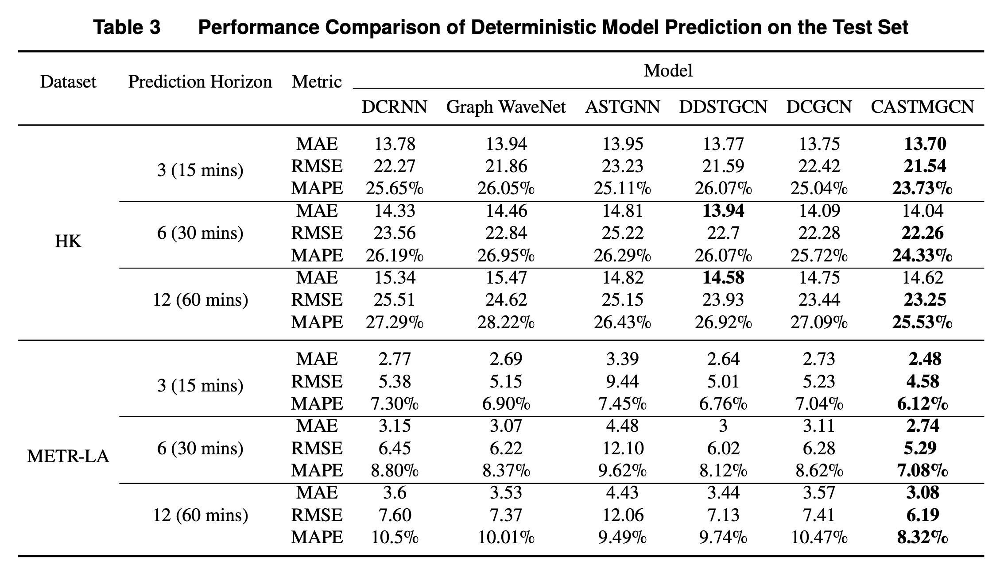
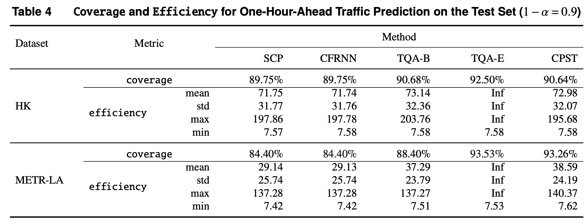
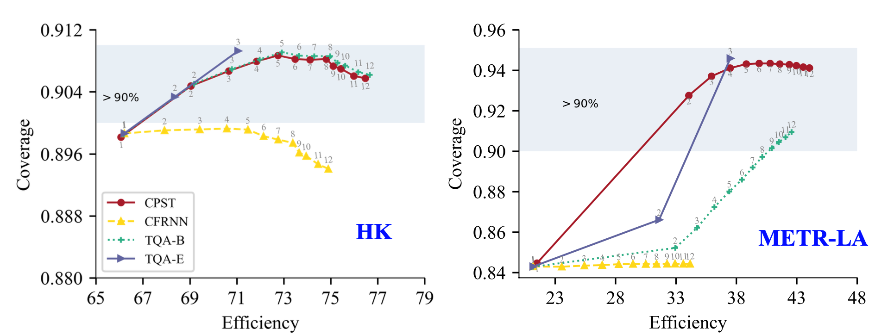

# Results

- Performance Comparison of Deterministic Model Prediction on the Test Set.

- Coverage and Efficiency for One-Hour-Ahead Traffic Prediction on the Test Set (1−𝛼=0.9).

 
- Efficiency and Coverage of Several CP Methods on the Test Set over Varying Time Steps.

- Percentage of Times Each Matrix is Selected for Traffic Prediction in the HK Dataset Under the max
Operator for Data Fusion.

- SVAR Reconstruction Loss Versus Prediction Performance Metrics on the METR-LA Dataset.

- Distribution of Uncertainty Averaged over all Time Periods on Hong Kong and Los Angeles.

- Results of Ablation Study.
